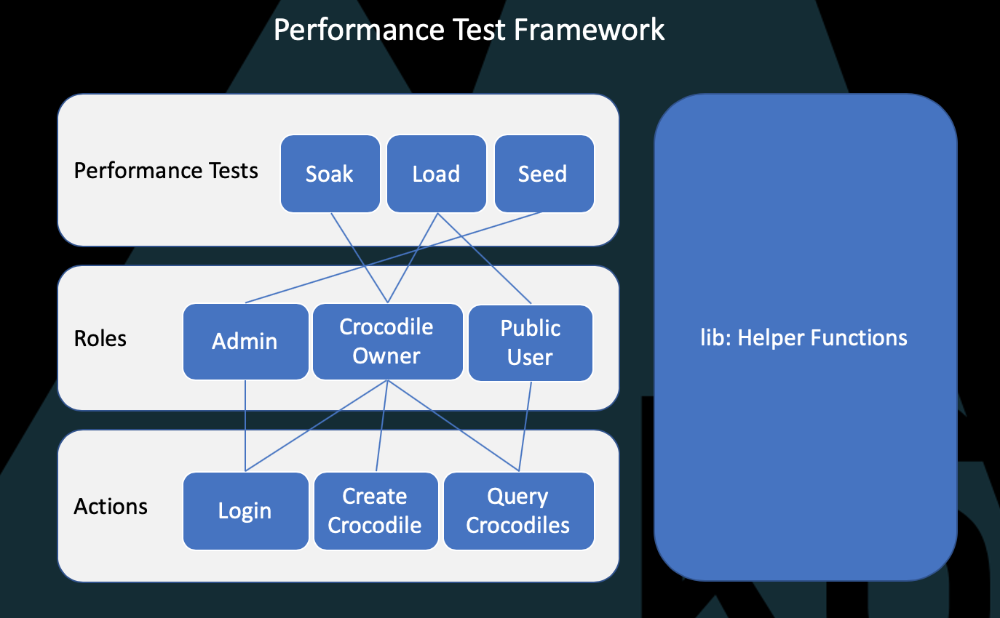

# k6 Typescript Framework
A starter framework for k6 load tests written in TypeScript.

We'll be using the [LoadImpact Test API](https://test-api.loadimpact.com/) as the website we'll be testing. This is a dummy application/api for crocodiles owners to use who want to keep track of their crocodiles. In the test we will **create a user**, **query** some crocodiles, and **create**, **update** and **delete** a crocodile.

## Quick Start :zap:

Install the [k6 performance test tool](https://docs.k6.io/docs/installation).

Clone this repository and open in the IDE of your choice.

Install dependencies using: 

`yarn install` 

in the terminal (you need to have [yarn](https://yarnpkg.com/getting-started/install) installed on your machine).

Now run the test using the following command: 

`yarn go:k6` 

This will run the [soak.test.ts](/src/tests/soak.test.ts) script, using **k6**.

## Run with Monitoring 

Ensure you have [docker](https://www.docker.com/products/docker-desktop) and [docker-compose](https://docs.docker.com/compose/install/) installed on your machine.

Start the monitors using the following command: 

`yarn monitors` 

Go to **localhost:3000** in your browser to login to Grafana with the username '**admin**' and the password '**admin**'.

Add the [k6 dashboard](https://grafana.com/grafana/dashboards/11837) to **Grafana** by following these instructions: [Importing a Dashboad](https://grafana.com/docs/grafana/latest/reference/export_import/)

Now run the test using the following command: 

`yarn go:docker` 

This will run the [soak.test.ts](/src/tests/soak.test.ts) script, using **k6** installed in a docker, which outputs the results to **influxDB**. **Grafana** is used to visualise the results.

**Please NOTE:** If you're running in **Windows** you'll need to use the full path for the local directories in the **volumes** sections of the [docker-compose.yaml](docker-compose.yml) file. See the [k6 documentation](https://docs.k6.io/docs/docker-on-windows) for more details.

## Run the 'Seed' Script

[create-crocs.seed.ts](src/tests/create-crocs.seed.ts)

This is an example of a script that you could use to 'seed' the application with test data before you run your performance tests. You can run it using the following command:

`yarn seed`.

This is just an example script and not needed for the test.

## The Test Framework :white_check_mark:

The test is based on the following sample script and API provided by k6:

https://test-api.loadimpact.com/

This is a dummy api for people who own crocodiles to keep track of their crocodiles. 

In the test we will **create** a user, **query** crocodiles, and **create**, **update** and **delete** a crocodile. The test also include [thresholds](https://docs.k6.io/docs/thresholds) and [checks](https://docs.k6.io/docs/checks)

I've converted the test to TypeScript and broken it out into modules so it's easier to use and scale.

Here's the high-level architecture diagram for the framework:

As you can see from the framework diagram above, k6 modules allow for a lot of code re-use. Let's go into more detail about each of the folders and what they do.

### **src** folder

All the code can be found in the `src` folder. And is written in TypeScript using [types provided by k6](https://github.com/DefinitelyTyped/DefinitelyTyped/tree/master/types/k6).

### **lib** folder

This folder contains bespoke `types` and helper functions. It's highly recommended that you unit test your helper functions (e.g. with [Jest](https://jestjs.io/)). However I've not done that here, just to keep things simple.

#### The types folder

This currently contains an interface for a 'User' in the system, specifying that they need a first name, last name, username and password.

### **actions** folder

The `actions` folder contains a script file for each user action. Each script file contains the requests that are sent when a user performs that particular action (e.g. login). The `roles` folder (inside the `actions` folder) contains a file for each user type and the actions they can perform.

#### *roles folder*

There are three types of user (or roles) that use the Crocodile app. The first is a *public user* that isn't logged into the system. They can query crocodiles, but can't create, update or delete them. The second are *crocodile owners* who can log in and create, read and update crocodiles. The third are *admin* users who can create other users. The admin users don't need to log in, as this is just a dummy app.

### **tests** folder

This is where you create your performance tests using the modules from the rest of the framework. `actions` are never called directly, but always through the `role` performing them (see the `actions` and `roles` folders above).

## Checking your Code

Use: 

`yarn check-types` 

to check your code against type safety and the rules set in your [tsconfig.json file](tsconfig.json). You can also have this running while you work using: 

`yarn check-types:watch`.

**PLEASE NOTE** I haven't set up `ESLint` and `Prettier` which this framework, but it's recommended that you do so.

## Building your Code

[Babel](https://babeljs.io/) handles the transpiling of the code (see the [.babelrc](.babelrc) file in the root directory), while [Webpack](https://webpack.js.org/) builds it (see the [webpack.config.js](webpack.config.js) file in the root directory).

## Debugging k6 :bug:

It's easy to debug `k6` scripts. See the [k6 documentation](https://docs.k6.io/docs/debugging) for more details.

## Running in CI/CD Pipelines 

`k6` has been designed to work with your `CI/CD` pipeline whatever tool you're using. There are examples for [GitHub Actions](https://blog.loadimpact.com/load-testing-using-github-actions), [GitLab](https://blog.loadimpact.com/integrating-load-testing-with-gitlab), [CircleCI](https://github.com/loadimpact/k6-circleci-example), [Jenkins](https://github.com/loadimpact/k6-jenkins-example) and many others. 

## Problems with this Framework 

If you notice any problems or improvements that could be made to this example framework, I accept PRs or you can raise an issue on the [k6 community forum](https://community.k6.io/)

## TO DO

I can't for the life of me get this framework working with k6's [base compatibility mode](https://github.com/MStoykov/k6-es6) for optimum performance. I'm putting this down to my lack of TypeScript and Webpack/Babel knowledge, so if anyone can solve this, please let me know or raise a PR!